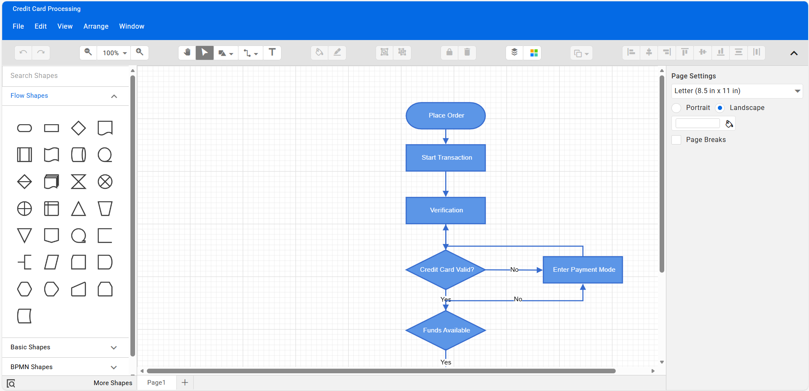

# Syncfusion® React Diagram Builder Showcase

An interactive, production-ready diagram builder built using Syncfusion® Essential Studio® for React. Create, edit, and manage diagrams such as Flowcharts, Mind Maps, Organizational Charts, and BPMN with a rich set of tools for drawing, styling, exporting, and collaboration. Ideal for process modeling, brainstorming sessions, architecture planning, and technical documentation.

### Why Use This React Diagram Builder?
- Build complex diagrams fast with drag-and-drop, snapping, and smart routing.
- Communicate processes clearly using rich shapes, connectors, annotations, and templates.
- Save, share, and integrate diagrams with JSON serialization and PNG/SVG/PDF export.
- Customize everything—stencils, templates, themes, and layout presets—to fit your workflow.
- Enterprise-ready: high performance and accessibility.

## Key Features
- Drag-and-drop shapes and connectors with snapping, routing, and orthogonal/straight/curved segments
- Stencils/Palettes: Flowchart, Mind Map, Org Chart, BPMN, and more
- Editing tools: selection, resize/rotate, pan/zoom, align/distribute, ordering, grouping/ungrouping
- Styling: fills, strokes, connector decorators, themes, and custom templates
- File operations: new, open (JSON), save (JSON), import/export
- Export/Print: PNG, JPEG, SVG, and PDF; print with page settings
- Mind Map and Org Chart assistants, layout presets, and templates
- Undo/redo, keyboard shortcuts, context menus, tooltips
- Responsive UI with adaptive panels and sidebar toolboxes

## Getting Started

### Prerequisites
- Node.js >= 18.0.0 (npm is installed with Node)

### Install & Run
To get the app up and running:

1.  **Clone the code:**  
    ```bash
    git clone https://gitea.syncfusion.com/essential-studio/ej2-react-diagram-builder
    cd ej2-react-diagram-builder
    ```

2.  **Install tools:**  
    ```bash
    npm install
    ```

3.  **Run in development mode:**  
    ```bash
    npm run start
    ```
---

## Usage
- Select a diagram type (Flowchart, Mind Map, Organizational Chart, BPMN) from the diagram types.
- Drag nodes to the canvas and connect them using the connector tool
- Use the toolbar to change tools (pointer, pan, connector), toggle grid/snap, arrange, align, and apply styles
- Open/Save diagrams as JSON; Export as PNG/JPEG/SVG/PDF; Print with page setup
- Switch themes by referencing a different Syncfusion® theme CSS (e.g., Fluent, Bootstrap 5)

### Basic Example: Diagram with Palette
Create a minimal page that exposes a left-side symbol palette and a right-side diagram surface. Drag symbols from the palette onto the canvas to compose a diagram.

For a quick start on setting up a React project with Syncfusion® Diagram, refer to our [Getting Started guide](https://ej2.syncfusion.com/react/documentation/diagram/getting-started).

1. **App Component (`App.js` or `App.jsx`)**

```jsx
import React from 'react';
import {
  DiagramComponent,
  SymbolPaletteComponent,
  PortVisibility
} from '@syncfusion/ej2-react-diagrams';

const styles = {
  row: { display: 'flex', gap: '12px' },
  col3: { width: '25%', minWidth: '240px' },
  col9: { flex: 1 },
};

function App() {
  // Basic node symbols
  const basicShapes = [
    { id: 'Rectangle', shape: { type: 'Basic', shape: 'Rectangle' } },
    { id: 'Ellipse',   shape: { type: 'Basic', shape: 'Ellipse' } },
    { id: 'Diamond',   shape: { type: 'Basic', shape: 'Diamond' } }
  ];

  // Connector symbols for palette
  const connectorSymbols = [
    {
      id: 'Orthogonal',
      type: 'Orthogonal',
      sourcePoint: { x: 0, y: 0 },
      targetPoint: { x: 50, y: 50 }
    },
    {
      id: 'Straight',
      type: 'Straight',
      sourcePoint: { x: 0, y: 0 },
      targetPoint: { x: 50, y: 50 }
    }
  ];

  // Define palettes
  const palettes = [
    { id: 'basic', title: 'Basic Shapes', expanded: true, symbols: basicShapes },
    { id: 'connectors', title: 'Connectors', expanded: true, symbols: connectorSymbols }
  ];

  // Node defaults (size, style, ports)
  const getNodeDefaults = (node) => {
    node.width = 120; node.height = 60;
    node.style = { fill: '#E3F2FD', strokeColor: '#1565C0', strokeWidth: 1 };
    node.ports = [
      { id: 'left',  offset: { x: 0,   y: 0.5 }, visibility: PortVisibility.Connect | PortVisibility.Hover },
      { id: 'right', offset: { x: 1.0, y: 0.5 }, visibility: PortVisibility.Connect | PortVisibility.Hover }
    ];
    return node;
  };

  // Connector defaults (style and arrow)
  const getConnectorDefaults = (connector) => {
    connector.style = { strokeColor: '#1565C0', strokeWidth: 1.5 };
    connector.targetDecorator = { shape: 'Arrow' };
    return connector;
  };

  return (
    <div style={styles.row}>
      <div style={styles.col3}>
        <SymbolPaletteComponent
          id="palette"
          width="100%"
          height="600px"
          palettes={palettes}
          symbolHeight={50}
          symbolWidth={50}
          symbolMargin={{ left: 10, right: 10, top: 10, bottom: 10 }}
        />
      </div>
      <div style={styles.col9}>
        <DiagramComponent
          id="container"
          width="100%"
          height="600px"
          snapSettings={{
            horizontalGridlines: { lineColor: '#EEEEEE' },
            verticalGridlines: { lineColor: '#EEEEEE' }
          }}
          getNodeDefaults={getNodeDefaults}
          getConnectorDefaults={getConnectorDefaults}
        />
      </div>
    </div>
  );
}

export default App;
```

Notes:
- Drag from the left palette and drop onto the canvas to create nodes/connectors.
- Ports are added on left/right to make connecting shapes easier. Adjust as needed.
- You can extend the palettes with Flowchart, BPMN, or custom SVG/image shapes.

For complete details on Layouts and diagram behavior, visit the Syncfusion® React Diagram [Documentation](https://ej2.syncfusion.com/react/documentation/diagram/getting-started).

### Customizing for Your Use Case
This showcase is designed to be flexible for teaching, experimentation, and tooling.

#### Customizing palette and appearance
- Palettes and Templates: Extend or modify stencil styles in css.
- Appearance: Override node/connector styles in component code or through property panels
- Layouts: Apply automatic layout options for org charts and mind maps; configure spacing/orientation

#### Customizing Styles
- Node Templates: Enhance nodes with images, icons, or additional fields using HTML/JS templates (e.g., annotations, tooltip templates, or setNodeTemplate/getNodeDefaults in EJ2 Diagram).
- Layout Options: Tune spacing and alignment using diagram.layout (type, horizontalSpacing, verticalSpacing, orientation) and a custom `getLayoutInfo` callback for side assignment.
- Styling: Override node and connector styles directly in code.
```jsx
  // Node defaults (size, style, ports)
  const getNodeDefaults = (node) => {
    node.width = 120; node.height = 60;
    node.style = { fill: '#E3F2FD', strokeColor: '#1565C0', strokeWidth: 1 };
    node.ports = [
      { id: 'left',  offset: { x: 0,   y: 0.5 }, visibility: PortVisibility.Connect | PortVisibility.Hover },
      { id: 'right', offset: { x: 1.0, y: 0.5 }, visibility: PortVisibility.Connect | PortVisibility.Hover }
    ];
    return node;
  };

  // Connector defaults (style and arrow)
  const getConnectorDefaults = (connector) => {
    connector.style = { strokeColor: '#1565C0', strokeWidth: 1.5 };
    connector.targetDecorator = { shape: 'Arrow' };
    return connector;
  };

  // <DiagramComponent getNodeDefaults={getNodeDefaults} getConnectorDefaults={getConnectorDefaults} />
```

#### Styling and Theming
- Switch built-in themes by changing the CSS reference (Material, Bootstrap 5, Fluent, etc.).
- Use Theme Studio to generate a custom theme CSS and replace the default stylesheet.

Example theme reference:
```html
<link href="https://cdn.syncfusion.com/ej2/material.css" rel="stylesheet" />
```

#### Interactions and Events
- Handle node/connector events for simulation toggles, selections, and property edits.
- Implement keyboard shortcuts for delete, duplicate, align, and distribute.

#### Persistence and Integration
- Serialize the diagram to JSON for save/load and sharing.
- Integrate with other Syncfusion® components like DataGrid for parts lists or Toast for notifications.

Best Practices: Keep node text concise, validate hierarchy during edits, and optimize large diagrams for performance.

## Demo
- Web: https://ej2.syncfusion.com/showcase/react/diagrambuilder/
- Screenshot: 


## Contributing
We welcome contributions! Fork the repo, make your changes, and submit a pull request. Please follow contribution best practices.

## License
Syncfusion® libraries require a valid license key in production. License guidance:
https://ej2.syncfusion.com/react/documentation/licensing/overview

## Support and Feedback
- Open issues in this repository’s Issues section: https://gitea.syncfusion.com/essential-studio/ej2-react-diagram-builder/issues.
- Explore more Syncfusion® React components: https://www.syncfusion.com/react-components.
- Community forums: https://www.syncfusion.com/forums.

Organize ideas visually and communicate clearly with the Syncfusion® React Diagram Builder Showcase.